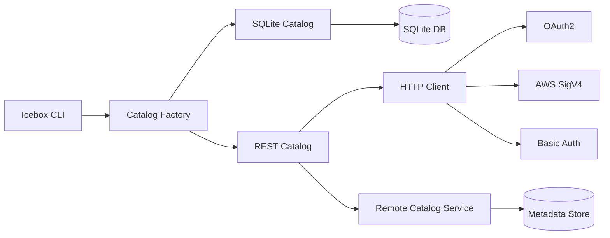
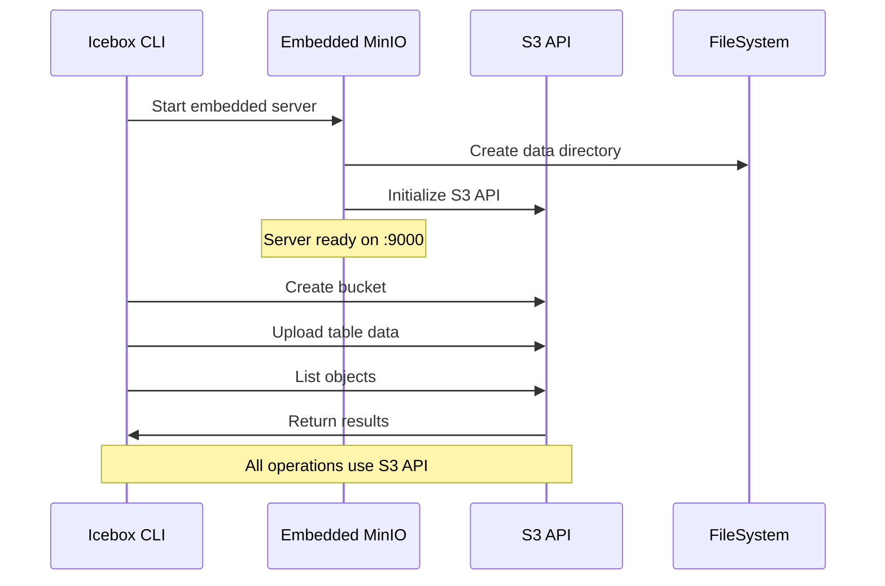
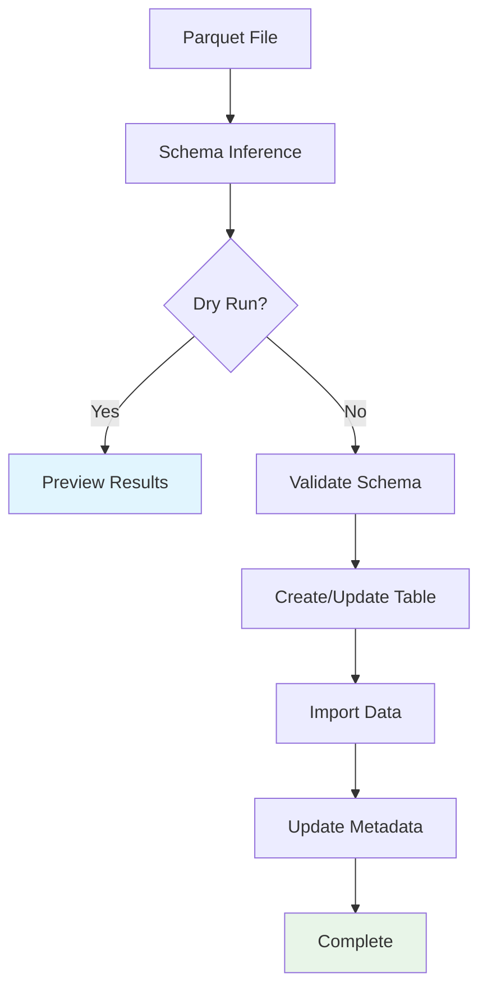
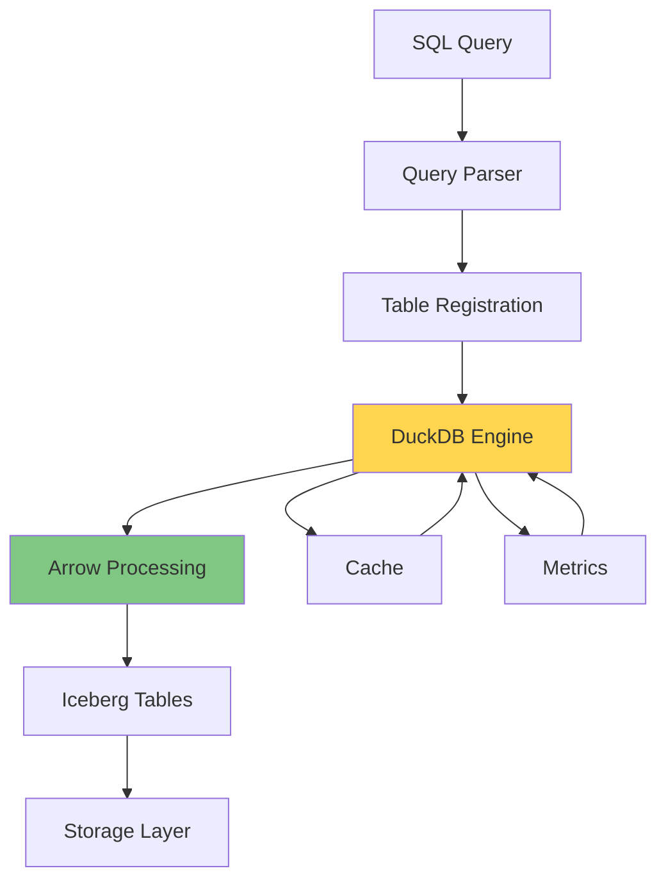
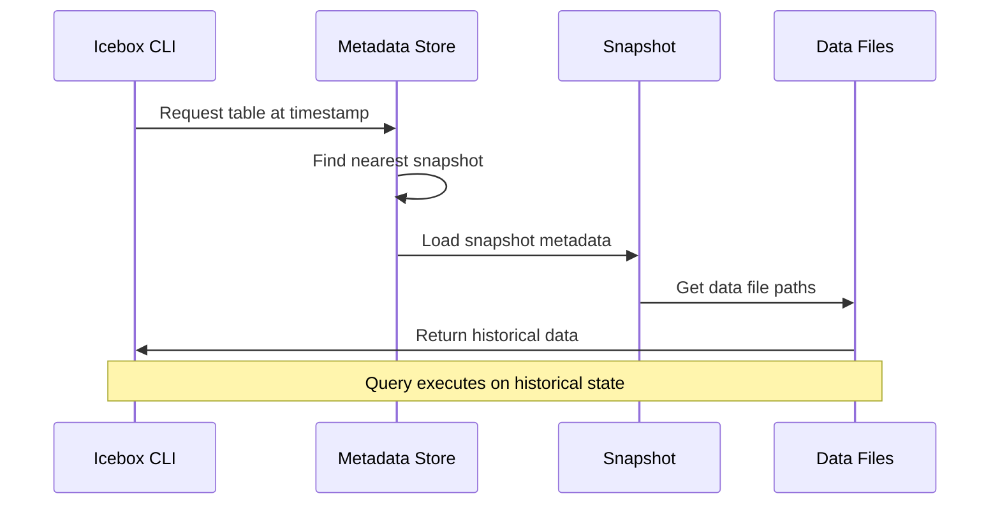
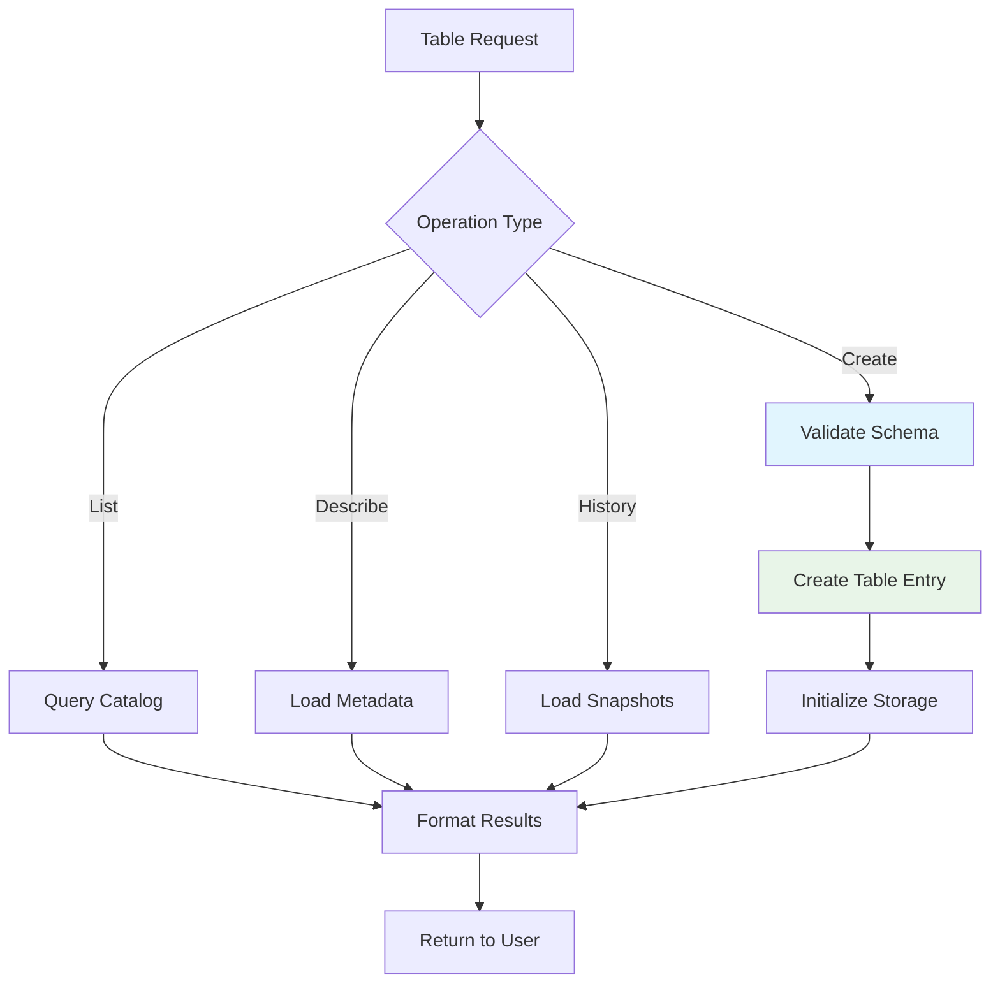
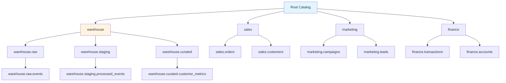
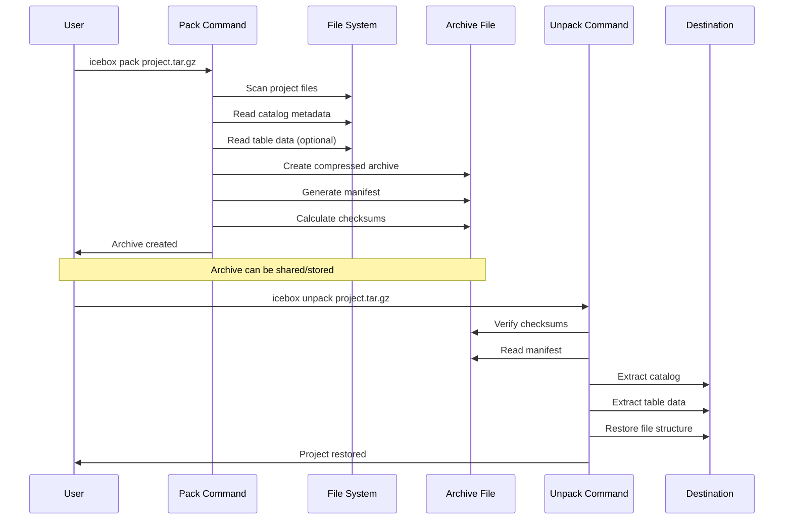

# 📚 Icebox Usage Guide

Complete documentation for all Icebox features and capabilities.

## 📖 Table of Contents

- [Project Initialization](#-project-initialization)
- [Catalog Configuration](#-catalog-configuration)
- [Embedded MinIO Server](#-embedded-minio-server)
- [Data Import & Management](#-data-import--management)
- [SQL Engine & Querying](#-sql-engine--querying)
- [Time-Travel Queries](#-time-travel-queries)
- [Table Operations](#-table-operations)
- [Namespace Management](#-namespace-management)
- [Pack & Unpack](#-pack--unpack)
- [Configuration Reference](#-configuration-reference)
- [Troubleshooting](#-troubleshooting)

---

## 🏗️ Project Initialization

### Quick Start

```bash
# Initialize new lakehouse project
./icebox init my-lakehouse
cd my-lakehouse

# Your project structure
tree .icebox/
# .icebox/
# ├── catalog/
# │   └── catalog.db     # SQLite catalog
# ├── data/              # Table storage
# └── minio/             # MinIO data (if enabled)
```

### Initialization Options

```bash
# SQLite catalog (default)
./icebox init my-project
./icebox init . --catalog sqlite

# REST catalog
./icebox init my-project --catalog rest --uri http://localhost:8181

# With custom storage location
./icebox init my-project --data-dir /custom/path/data
```

### Project Structure Flow

```mermaid
graph TD
    A[icebox init] --> B{Catalog Type?}
    B -->|SQLite| C[Create .icebox/catalog/]
    B -->|REST| D[Configure REST endpoint]
    C --> E[Create .icebox/data/]
    D --> E
    E --> F[Generate .icebox.yml]
    F --> G[Initialize MinIO (optional)]
    G --> H[Ready for use]
```

---

## 📁 Catalog Configuration

Icebox supports both **SQLite** (embedded) and **REST** (distributed) catalogs with comprehensive configuration options.

### SQLite Catalog (Default)

**Advantages:**

- ✅ Zero configuration
- ✅ Local development
- ✅ Fast operations
- ✅ No external dependencies

```yaml
name: my-lakehouse
catalog:
  type: sqlite
  sqlite:
    path: .icebox/catalog/catalog.db
```

### REST Catalog

**Advantages:**

- ✅ Production ready
- ✅ Multi-user access
- ✅ Enterprise authentication
- ✅ Cloud storage integration

```yaml
name: production-lakehouse
catalog:
  type: rest
  rest:
    uri: https://catalog.example.com
    # Authentication options below
```

### Authentication Methods

#### OAuth 2.0 Authentication

```yaml
catalog:
  rest:
    uri: https://catalog.example.com
    oauth:
      credential: "client_credentials"
      auth_url: "https://auth.example.com/oauth/token"
      scope: "catalog:read catalog:write"
      # Optional: provide token directly
      token: "eyJhbGciOiJIUzI1NiIsInR5cCI6IkpXVCJ9..."
```

#### AWS Signature Version 4

```yaml
catalog:
  rest:
    uri: https://api-gateway.execute-api.us-west-2.amazonaws.com
    sigv4:
      enabled: true
      region: "us-west-2"
      service: "execute-api"
```

#### Basic Authentication

```yaml
catalog:
  rest:
    uri: https://catalog.example.com
    credentials:
      username: "catalog-user"
      password: "secure-password"
```

### Catalog Architecture



---

## 🗄️ Embedded MinIO Server

**New Feature:** Icebox now includes an embedded MinIO server for S3-compatible storage, perfect for testing production workflows locally.

### Features

- 🚀 **S3-Compatible API** - Test cloud storage workflows locally
- 🔧 **Auto-Configuration** - Zero-setup embedded server
- 🛡️ **Secure by Default** - Configurable authentication and TLS
- 📊 **Performance Optimized** - Connection pooling and timeouts
- 🌐 **Web Console** - Optional browser-based management

### Quick Start

```bash
# Initialize with embedded MinIO
./icebox init my-project --storage minio

# Or enable in existing project
cat >> .icebox.yml << EOF
storage:
  type: minio
  minio:
    embedded: true
    port: 9000
    console: true
EOF

# Start Icebox (MinIO starts automatically)
./icebox sql "SHOW TABLES"
```

### MinIO Configuration

```yaml
storage:
  type: minio
  minio:
    # Embedded server settings
    embedded: true
    port: 9000
    address: "localhost"
    data_dir: ".icebox/minio"
    
    # Authentication
    access_key: "minioadmin"
    secret_key: "minioadmin"
    
    # Features
    console: true           # Enable web console
    auto_start: true       # Start with Icebox
    secure: false          # HTTP for development
    
    # Performance tuning
    max_idle_conns: 100
    connect_timeout: "30s"
    request_timeout: "60s"
    
    # Storage configuration
    region: "us-east-1"
    default_bucket: "icebox"
```

### MinIO Workflow



### MinIO Console Access

When `console: true` is enabled:

1. **Access URL:** `http://localhost:9000`
2. **Credentials:** Use configured `access_key` and `secret_key`
3. **Features:**
   - Browse buckets and objects
   - Upload/download files
   - Monitor server metrics
   - Manage access policies

### Advanced MinIO Setup

#### Production-Ready Configuration

```yaml
storage:
  type: minio
  minio:
    embedded: true
    secure: true              # Enable HTTPS
    port: 9443               # HTTPS port
    
    # Strong credentials
    access_key: "icebox-admin"
    secret_key: "super-secure-key-min-32-chars"
    
    # TLS configuration
    cert_file: "/path/to/cert.pem"
    key_file: "/path/to/key.pem"
    
    # Custom properties
    properties:
      "MINIO_STORAGE_CLASS_STANDARD": "EC:4"
      "MINIO_CACHE_DRIVES": "/tmp/cache"
```

#### External MinIO Server

```yaml
storage:
  type: minio
  minio:
    embedded: false          # Use external server
    endpoint: "minio.example.com:9000"
    access_key: "your-key"
    secret_key: "your-secret"
    secure: true
    bucket: "my-data-bucket"
```

---

## 📥 Data Import & Management

### Parquet Import

#### Basic Import

```bash
# Import to default namespace
./icebox import sales_data.parquet --table sales

# Import to specific namespace
./icebox import events.parquet --table analytics.user_events

# Preview without importing
./icebox import large_file.parquet --table test --dry-run
```

#### Advanced Import Options

```bash
# Schema inference and preview
./icebox import data.parquet --table customers --infer-schema

# Replace existing table
./icebox import updated_data.parquet --table sales --overwrite

# Custom table properties
./icebox import data.parquet --table sales \
  --property "owner=data-team" \
  --property "retention.days=90"
```

#### Import with Partitioning

```bash
# Partition by column
./icebox import sales.parquet --table sales --partition-by region,date

# Multiple partition columns
./icebox import events.parquet --table analytics.events \
  --partition-by event_date,user_segment
```

### Import Workflow



### Data Import Examples

#### Financial Data Pipeline

```bash
# Import transaction data with partitioning
./icebox import transactions_2024.parquet \
  --table finance.transactions \
  --partition-by transaction_date,account_type \
  --property "classification=sensitive" \
  --property "retention.years=7"

# Import customer data
./icebox import customers.parquet \
  --table finance.customers \
  --property "pii=true"

# Verify imports
./icebox table list --namespace finance
./icebox table describe finance.transactions
```

#### Analytics Data Pipeline

```bash
# Import user events with time partitioning
./icebox import user_events.parquet \
  --table analytics.events \
  --partition-by event_date \
  --sort-by user_id,timestamp

# Import user dimensions
./icebox import user_profiles.parquet \
  --table analytics.users \
  --property "update_frequency=daily"

# Query across tables
./icebox sql "
SELECT u.segment, COUNT(*) as events
FROM analytics.events e
JOIN analytics.users u ON e.user_id = u.user_id
WHERE e.event_date >= '2024-01-01'
GROUP BY u.segment
"
```

---

## 🔍 SQL Engine & Querying

Icebox integrates **DuckDB** for high-performance analytical queries with Apache Arrow for efficient data processing.

### Query Execution

#### One-off Queries

```bash
# Simple queries
./icebox sql "SELECT COUNT(*) FROM sales"
./icebox sql "SHOW TABLES"
./icebox sql "DESCRIBE customers"

# Complex analytics
./icebox sql "
SELECT 
    region,
    DATE_TRUNC('month', order_date) as month,
    SUM(amount) as total_sales,
    COUNT(*) as order_count
FROM sales 
WHERE order_date >= '2024-01-01'
GROUP BY region, month
ORDER BY month, total_sales DESC
"
```

#### Output Formats

```bash
# Table format (default)
./icebox sql "SELECT * FROM customers LIMIT 5"

# CSV output
./icebox sql "SELECT region, SUM(sales) FROM sales GROUP BY region" --format csv

# JSON output
./icebox sql "SELECT * FROM products WHERE price > 100" --format json

# Save to file
./icebox sql "SELECT * FROM large_table" --format csv > output.csv
```

### Interactive SQL Shell

```bash
# Start interactive shell
./icebox shell

# Shell with performance metrics
./icebox shell --metrics
```

#### Shell Commands

```sql
-- Table and schema exploration
\tables                    -- List all tables
\tables analytics          -- List tables in namespace
\schema customers          -- Show table schema
\describe sales            -- Detailed table information

-- Query management
\history                   -- View command history
\metrics                   -- Show performance metrics
\clear                     -- Clear screen
\help                      -- Show help
\quit                      -- Exit shell

-- Multi-line queries (automatically detected)
SELECT region,
       AVG(lifetime_value) as avg_ltv,
       COUNT(*) as customers
FROM customers 
GROUP BY region 
ORDER BY avg_ltv DESC;
```

### Query Performance Optimization

#### Performance Monitoring

```bash
# Enable metrics for queries
./icebox sql "SELECT COUNT(*) FROM large_table" --metrics

# Output:
# 📈 Engine Metrics:
#   Queries Executed: 1
#   Total Query Time: 234ms
#   Tables Registered: 3
#   Cache Hits: 2
#   Cache Misses: 1
```

#### Query Optimization Tips

```sql
-- Use column projection
SELECT customer_id, name FROM customers;  -- Better
SELECT * FROM customers;                  -- Avoid

-- Filter early
SELECT * FROM sales 
WHERE region = 'North' AND date >= '2024-01-01';

-- Use appropriate JOINs
SELECT c.name, SUM(s.amount)
FROM customers c
JOIN sales s ON c.id = s.customer_id
GROUP BY c.name;

-- Leverage partitioning
SELECT * FROM events 
WHERE event_date BETWEEN '2024-01-01' AND '2024-01-31';
```

### SQL Engine Architecture



---

## ⏰ Time-Travel Queries

Query your Iceberg tables at any point in their history using timestamps or snapshot IDs.

### Time-Travel Syntax

#### By Timestamp

```bash
# RFC3339 timestamp format
./icebox time-travel sales --as-of "2024-01-15T10:30:00Z"

# Date only (midnight UTC)
./icebox time-travel sales --as-of "2024-01-15"

# Relative time
./icebox time-travel sales --as-of "2024-01-15T10:30:00-08:00"
```

#### By Snapshot ID

```bash
# Specific snapshot
./icebox time-travel sales --as-of 1234567890123456789

# Get snapshot IDs from table history
./icebox table history sales
```

### Time-Travel Examples

#### Data Recovery

```bash
# Check data before accidental deletion
./icebox time-travel customers --as-of "2024-01-14T23:59:59Z" \
  --query "SELECT COUNT(*) FROM customers"

# Compare current vs historical data
./icebox sql "SELECT COUNT(*) FROM customers"  # Current
./icebox time-travel customers --as-of "2024-01-01" \
  --query "SELECT COUNT(*) FROM customers"     # Historical
```

#### Audit and Compliance

```bash
# Monthly reporting snapshot
./icebox time-travel transactions --as-of "2024-01-31T23:59:59Z" \
  --query "SELECT SUM(amount) FROM transactions WHERE type = 'SALE'" \
  --format json > january_sales_report.json

# Point-in-time compliance check
./icebox time-travel user_data --as-of "2024-06-01" \
  --query "SELECT COUNT(*) FROM user_data WHERE gdpr_consent = true"
```

#### Data Evolution Analysis

```bash
# Track schema evolution
./icebox time-travel products --as-of "2023-01-01" --show-schema
./icebox time-travel products --as-of "2024-01-01" --show-schema

# Compare data quality over time
./icebox time-travel sales --as-of "2024-01-01" \
  --query "SELECT COUNT(*) as total, 
                  COUNT(customer_id) as with_customer,
                  COUNT(*) - COUNT(customer_id) as missing_customer
           FROM sales"
```

### Time-Travel Workflow



---

## 📊 Table Operations

Comprehensive table management with creation, modification, and maintenance operations.

### Table Listing

```bash
# List all tables
./icebox table list

# List tables in specific namespace
./icebox table list --namespace analytics

# List tables across all namespaces
./icebox table list --all-namespaces

# JSON output for programmatic use
./icebox table list --format json
```

### Table Description

```bash
# Basic table information
./icebox table describe sales

# Include table properties
./icebox table describe sales --show-properties

# Namespaced tables
./icebox table describe analytics.user_events
```

#### Table Description Output

```
📊 Table: [default sales]

🗂️  Schema:
   1. customer_id: long
   2. order_date: date
   3. amount: double
   4. region: string
   5. product_category: string (nullable)

📍 Location: file:///.icebox/data/default/sales
📅 Created: 2024-01-15T10:30:00Z
📝 Format: Iceberg (format-version=2)
🔢 Snapshots: 5

📊 Statistics:
   Records: 1,000,000
   Data files: 45
   Size: 127.8 MB

🏷️  Properties:
   owner: data-team
   created_by: icebox
   retention.days: 90
```

### Table History

```bash
# Show complete snapshot history
./icebox table history sales

# Limit number of snapshots
./icebox table history sales --max-snapshots 20

# Reverse order (oldest first)
./icebox table history sales --reverse

# JSON output
./icebox table history sales --format json
```

#### Table History Output

```
📈 Table History: [default sales]

┌─────────────────────┬────────────────────┬───────────┬──────────────┬─────────────┐
│ Snapshot ID         │ Timestamp          │ Operation │ Data Files   │ Records     │
├─────────────────────┼────────────────────┼───────────┼──────────────┼─────────────┤
│ 1234567890123456789 │ 2024-01-15T15:30Z  │ append    │ 45 (+5)     │ 1,000,000   │
│ 1234567890123456788 │ 2024-01-15T10:30Z  │ append    │ 40 (+40)    │ 900,000     │
│ 1234567890123456787 │ 2024-01-14T18:45Z  │ create    │ 0 (+0)      │ 0           │
└─────────────────────┴────────────────────┴───────────┴──────────────┴─────────────┘

📊 Summary:
   Total snapshots: 3
   Current records: 1,000,000
   Total operations: 2 append, 1 create
```

### Table Creation

```bash
# Create table with default schema
./icebox table create test_table

# Create with explicit schema
./icebox table create sales --schema sales_schema.json

# Create with partitioning
./icebox table create events --partition-by event_date,user_segment

# Create with sort order
./icebox table create transactions --sort-by timestamp,account_id

# Create with properties
./icebox table create customers \
  --property "owner=analytics-team" \
  --property "retention.years=7" \
  --property "classification=sensitive"
```

#### Schema File Format

```json
{
  "type": "struct",
  "fields": [
    {
      "id": 1,
      "name": "customer_id",
      "required": true,
      "type": "long"
    },
    {
      "id": 2,
      "name": "order_date",
      "required": true,
      "type": "date"
    },
    {
      "id": 3,
      "name": "amount",
      "required": true,
      "type": "double"
    },
    {
      "id": 4,
      "name": "region",
      "required": false,
      "type": "string"
    }
  ]
}
```

### Table Management Workflow



---

## 📁 Namespace Management

Organize your tables hierarchically using namespaces for better data governance and organization.

### Namespace Operations

#### List Namespaces

```bash
# List all namespaces
./icebox catalog list

# List with JSON output
./icebox catalog list --format json

# List namespaces under specific parent
./icebox catalog list --parent warehouse
```

#### Create Namespaces

```bash
# Create top-level namespace
./icebox catalog create analytics

# Create nested namespace
./icebox catalog create warehouse.raw
./icebox catalog create warehouse.processed
./icebox catalog create warehouse.curated

# Create with properties
./icebox catalog create finance \
  --property "owner=finance-team" \
  --property "classification=restricted" \
  --property "retention.years=10"
```

#### Drop Namespaces

```bash
# Drop empty namespace
./icebox catalog drop test_namespace

# Force drop with all tables (be careful!)
./icebox catalog drop old_project --force
```

### Namespace Organization Patterns

#### By Business Domain

```bash
# Create domain-based structure
./icebox catalog create sales
./icebox catalog create marketing  
./icebox catalog create finance
./icebox catalog create operations

# Import data to appropriate domains
./icebox import transactions.parquet --table finance.transactions
./icebox import campaigns.parquet --table marketing.campaigns
./icebox import orders.parquet --table sales.orders
```

#### By Data Processing Stage

```bash
# Create data pipeline stages
./icebox catalog create raw          # Source data
./icebox catalog create staging      # Intermediate processing
./icebox catalog create curated      # Business-ready data
./icebox catalog create analytics    # Analytical datasets

# Data flow through stages
./icebox import source_data.parquet --table raw.customer_events
# ... processing steps ...
./icebox import processed_data.parquet --table curated.customer_metrics
```

#### By Environment

```bash
# Create environment-based structure
./icebox catalog create dev
./icebox catalog create staging
./icebox catalog create prod

# Environment-specific tables
./icebox import test_data.parquet --table dev.experiments
./icebox import staging_data.parquet --table staging.validation
./icebox import prod_data.parquet --table prod.customers
```

### Namespace Hierarchy Visualization



---

## 📦 Pack & Unpack

Create portable archives of your Icebox projects for sharing, backup, and distribution.

### Pack Operations

#### Basic Pack

```bash
# Create archive of current project
./icebox pack my-project.tar.gz

# Pack with custom name
./icebox pack --name "analytics-project" output.tar.gz

# Pack without data files (metadata only)
./icebox pack --no-data lightweight.tar.gz
```

#### Advanced Pack Options

```bash
# Pack with compression
./icebox pack --compression gzip my-project.tar.gz

# Pack specific namespaces only
./icebox pack --namespace analytics,sales filtered.tar.gz

# Pack with verification
./icebox pack --verify checksums.tar.gz

# Pack with custom metadata
./icebox pack --description "Monthly analytics dataset" \
  --tag "2024-01" \
  --tag "analytics" \
  monthly-data.tar.gz
```

### Unpack Operations

#### Basic Unpack

```bash
# Unpack to new directory
./icebox unpack my-project.tar.gz

# Unpack to specific directory
./icebox unpack --output /path/to/destination my-project.tar.gz

# Preview archive contents
./icebox unpack --list my-project.tar.gz
```

#### Advanced Unpack Options

```bash
# Unpack without data files
./icebox unpack --no-data metadata-only.tar.gz

# Unpack specific namespaces
./icebox unpack --namespace analytics archived-project.tar.gz

# Verify integrity during unpack
./icebox unpack --verify my-project.tar.gz

# Overwrite existing files
./icebox unpack --overwrite existing-project.tar.gz
```

### Pack/Unpack Workflow



### Archive Structure

```
my-project.tar.gz
├── manifest.json           # Archive metadata and file index
├── .icebox.yml             # Project configuration
├── catalog/
│   └── catalog.db          # SQLite catalog database
├── data/                   # Table data files (optional)
│   ├── sales/
│   │   ├── metadata/
│   │   └── data/
│   └── analytics/
│       ├── metadata/
│       └── data/
└── checksums.sha256        # File integrity verification
```

#### Manifest Format

```json
{
  "name": "analytics-project",
  "version": "0.1.0",
  "created_at": "2024-01-15T10:30:00Z",
  "description": "Monthly analytics dataset",
  "tags": ["2024-01", "analytics"],
  "includes_data": true,
  "catalog_type": "sqlite",
  "namespaces": ["default", "analytics", "sales"],
  "tables": [
    {
      "namespace": "analytics",
      "name": "events",
      "records": 1000000,
      "size_bytes": 45234567
    }
  ],
  "files": [
    {
      "path": ".icebox.yml",
      "size": 342,
      "checksum": "sha256:abc123..."
    }
  ]
}
```

---

## ⚙️ Configuration Reference

Complete reference for all Icebox configuration options.

### Project Configuration (.icebox.yml)

```yaml
# Project identification
name: my-lakehouse
version: "0.1.0"
description: "Analytics data lakehouse"

# Catalog configuration
catalog:
  type: sqlite | rest
  
  # SQLite catalog
  sqlite:
    path: .icebox/catalog/catalog.db
    
  # REST catalog
  rest:
    uri: https://catalog.example.com
    warehouse_location: s3://bucket/warehouse
    prefix: v1/catalogs/prod
    
    # Authentication
    oauth:
      credential: client_credentials
      auth_url: https://auth.example.com/oauth/token
      scope: "catalog:read catalog:write"
      token: "optional-direct-token"
    
    sigv4:
      enabled: true
      region: us-west-2
      service: execute-api
      
    credentials:
      username: user
      password: pass
      
    # TLS settings
    tls:
      skip_verify: false
      cert_file: /path/to/cert.pem
      key_file: /path/to/key.pem
      
    # Custom properties
    additional_properties:
      "custom.header": "value"
      "timeout.seconds": "30"

# Storage configuration
storage:
  type: filesystem | minio
  
  # Local filesystem
  filesystem:
    root_path: .icebox/data
    
  # MinIO storage
  minio:
    # Embedded MinIO server
    embedded: true
    port: 9000
    address: localhost
    data_dir: .icebox/minio
    
    # Authentication
    access_key: minioadmin
    secret_key: minioadmin
    
    # Server features
    console: true
    auto_start: true
    secure: false
    quiet: true
    
    # Performance
    max_idle_conns: 100
    max_idle_conns_per_host: 10
    connect_timeout: 30s
    request_timeout: 60s
    
    # Storage settings
    region: us-east-1
    default_bucket: icebox
    
    # Custom properties
    properties:
      MINIO_STORAGE_CLASS_STANDARD: "EC:4"
      MINIO_CACHE_DRIVES: "/tmp/cache"

# SQL engine configuration
engine:
  type: duckdb
  duckdb:
    memory_limit: 1GB
    threads: 4
    cache_size: 256MB
    
# Import settings
import:
  default_namespace: default
  auto_create_namespace: true
  partition_strategy: auto
  
  # Schema inference
  schema_inference:
    sample_size: 10000
    null_threshold: 0.8
    
# Query settings  
query:
  default_format: table
  max_rows: 1000
  timeout: 300s
  
  # Output formatting
  formats:
    table:
      max_column_width: 50
      show_types: false
    csv:
      delimiter: ","
      quote_char: "\""
    json:
      pretty: true
      
# CLI settings
cli:
  output:
    colors: true
    icons: true
    progress: true
  
  shell:
    history_file: .icebox/history
    history_size: 1000
    multiline: true
    
# Advanced settings
advanced:
  # Parallel processing
  parallelism:
    import_workers: 4
    query_threads: 8
    
  # Caching
  cache:
    enabled: true
    size: 128MB
    ttl: 1h
    
  # Logging
  logging:
    level: info
    file: .icebox/icebox.log
    format: json
```

### Environment Variables

Icebox supports environment variable overrides for all configuration settings:

```bash
# Catalog configuration
export ICEBOX_CATALOG_TYPE=rest
export ICEBOX_CATALOG_REST_URI=https://catalog.example.com
export ICEBOX_CATALOG_REST_OAUTH_TOKEN=your-token

# Storage configuration
export ICEBOX_STORAGE_TYPE=minio
export ICEBOX_STORAGE_MINIO_ACCESS_KEY=admin
export ICEBOX_STORAGE_MINIO_SECRET_KEY=password

# Engine configuration
export ICEBOX_ENGINE_DUCKDB_MEMORY_LIMIT=2GB
export ICEBOX_ENGINE_DUCKDB_THREADS=8

# CLI configuration
export ICEBOX_CLI_OUTPUT_COLORS=false
export ICEBOX_QUERY_DEFAULT_FORMAT=json
```

### Configuration Precedence

Configuration values are resolved in the following order (highest to lowest priority):

1. **Command-line flags**
2. **Environment variables**
3. **Configuration file (.icebox.yml)**
4. **Default values**

---

## 🔧 Troubleshooting

Common issues and their solutions.

### Installation Issues

#### Go Build Errors

```bash
# Error: Go version too old
go version  # Should be 1.21+

# Update Go
# macOS with Homebrew
brew install go

# Linux
wget https://golang.org/dl/go1.21.6.linux-amd64.tar.gz
sudo tar -C /usr/local -xzf go1.21.6.linux-amd64.tar.gz
export PATH=$PATH:/usr/local/go/bin
```

#### Missing Dependencies

```bash
# Error: missing dependencies
go mod tidy
go mod download

# Clear module cache if needed
go clean -modcache
go mod download
```

### Catalog Issues

#### SQLite Catalog Problems

```bash
# Error: database locked
# Solution: Ensure no other Icebox processes are running
ps aux | grep icebox
kill <pid>

# Error: database corrupted
# Solution: Reinitialize catalog (data tables preserved)
rm .icebox/catalog/catalog.db
./icebox init --force
```

#### REST Catalog Authentication

```bash
# OAuth token expired
# Solution: Refresh token in configuration
vim .icebox.yml  # Update oauth.token

# Connection timeout
# Solution: Check network and increase timeout
export ICEBOX_CATALOG_REST_TIMEOUT=60s
```

### Import Issues

#### Large File Import

```bash
# Error: out of memory during import
# Solution: Increase memory limit or process in chunks
export ICEBOX_ENGINE_DUCKDB_MEMORY_LIMIT=4GB

# Split large files
# Use external tool to split Parquet files into smaller chunks
```

#### Schema Conflicts

```bash
# Error: schema mismatch
# Solution: Check schema and use explicit schema file
./icebox import data.parquet --table sales --schema schema.json

# Or force overwrite
./icebox import data.parquet --table sales --overwrite
```

### Query Issues

#### Performance Problems

```bash
# Slow queries
# Solution: Check query plan and add indexes
./icebox sql "EXPLAIN SELECT * FROM large_table WHERE id = 123"

# Enable metrics
./icebox sql "SELECT COUNT(*) FROM table" --metrics

# Optimize DuckDB settings
export ICEBOX_ENGINE_DUCKDB_THREADS=8
export ICEBOX_ENGINE_DUCKDB_MEMORY_LIMIT=4GB
```

#### Connection Issues

```bash
# Error: table not found
# Solution: Check table registration
./icebox table list
./icebox sql "SHOW TABLES"

# Re-register tables if needed
./icebox sql "REFRESH"
```

### MinIO Issues

#### Port Conflicts

```bash
# Error: port 9000 already in use
# Solution: Check what's using the port
lsof -i :9000
sudo kill -9 <pid>

# Or use different port
vim .icebox.yml  # Change minio.port to 9001
```

#### Permission Issues

```bash
# Error: permission denied on data directory
# Solution: Fix permissions
chmod 755 .icebox/minio
chown $USER .icebox/minio

# Or use different directory
export ICEBOX_STORAGE_MINIO_DATA_DIR=/tmp/icebox-minio
```

### Debugging Tips

#### Enable Debug Logging

```bash
# Enable debug output
export ICEBOX_LOG_LEVEL=debug
./icebox sql "SELECT COUNT(*) FROM table"

# Save logs to file
export ICEBOX_LOG_FILE=.icebox/debug.log
```

#### Verbose Output

```bash
# Use verbose flag for detailed output
./icebox import data.parquet --table test --verbose
./icebox sql "SELECT * FROM table" --verbose
```

#### Check System Resources

```bash
# Monitor resource usage
htop
df -h
free -h

# Check DuckDB memory usage
./icebox sql "SELECT * FROM duckdb_memory()" --format table
```

### Getting Help

If you encounter issues not covered here:

1. **Check logs** in `.icebox/icebox.log`
2. **Search issues** on GitHub
3. **Create issue** with:
   - Icebox version
   - Operating system
   - Complete error message
   - Steps to reproduce
   - Configuration file (sanitized)

```bash
# Get version information
./icebox version

# Generate debug report
./icebox debug --output debug-report.txt
